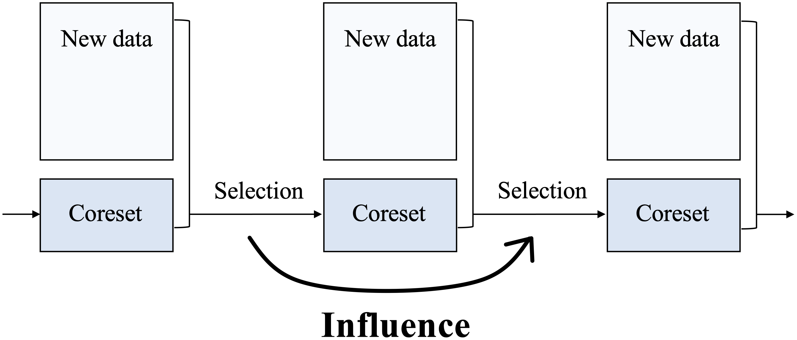
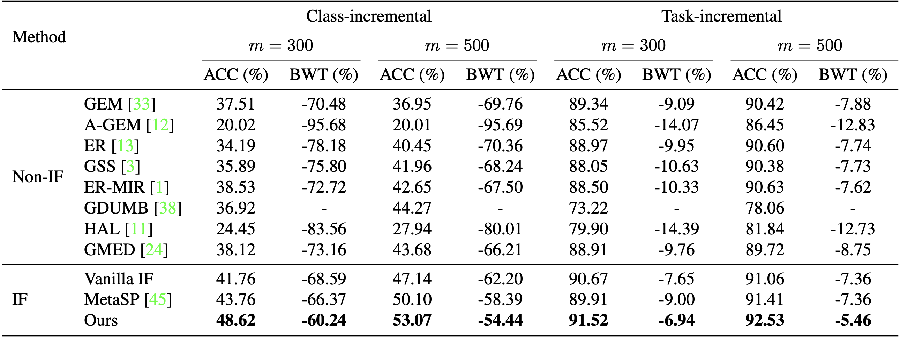

# InfluenceCL

Code for CVPR 2023 paper [Regularizing Second-Order Influences for Continual Learning](https://openaccess.thecvf.com/content/CVPR2023/papers/Sun_Regularizing_Second-Order_Influences_for_Continual_Learning_CVPR_2023_paper.pdf).

<p align="center">
    
</p>

In continual learning, earlier coreset selection exerts a profound influence on subsequent steps through the data flow. Our proposed scheme regularizes the future influence of each selection. In its absence, a greedy selection strategy would degrade over time.

## Dependencies

```shell
pip install -r requirements.txt
```

Please specify the CUDA and CuDNN version for jax explicitly. If you are using CUDA 10.2 or order, you would also need to manually choose an older version of tf2jax and neural-tangents.

## Quick Start

Train and evaluate models through `utils/main.py`. For example, to train our model on Split CIFAR-10 with a 500 fixed-size buffer, one could execute:
```shell
python utils/main.py --model soif --load_best_args --dataset seq-cifar10 --buffer_size 500
```

To compare with the result of vanilla influence functions, simply run:
```shell
python utils/main.py --model soif --load_best_args --dataset seq-cifar10 --buffer_size 500 --nu 0
```

More datasets and methods are supported. You can find the available options by running:
```shell
python utils/main.py --help
```

## Results

The following results on Split CIFAR-10 were obtained with single NVIDIA 2080 Ti GPU:



## Citation

If you find this code useful, please consider citing:
```bibtex
@inproceedings{sun2023regularizing,
  title={Regularizing Second-Order Influences for Continual Learning},
  author={Sun, Zhicheng and Mu, Yadong and Hua, Gang},
  booktitle={Proceedings of the IEEE/CVF Conference on Computer Vision and Pattern Recognition},
  pages={20166--20175},
  year={2023},
}
```

## Acknowledgement

Our implementation is based on [Mammoth](https://github.com/aimagelab/mammoth). We also refer to [bilevel_coresets](https://github.com/zalanborsos/bilevel_coresets) and [Example_Influence_CL](https://github.com/SSSunQing/Example_Influence_CL).
